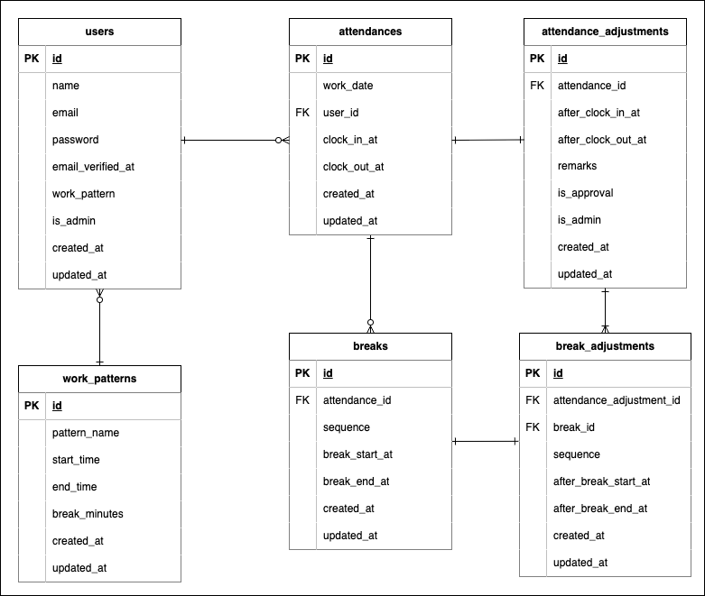

# Attendance-Management

## 環境構築

### Docker ビルド

```
git clone git@github.com:Takeshi410/Attendance-Management.git
cd Attendance-Management
docker-compose up -d --build
```

MySQL は OS によって起動しない場合があるので、それぞれの PC に合わせてdocker-compose.yml ファイルを編集してください。

### Laravel 環境構築

```
docker-compose exec php bash
composer install
cp .env.example .env
```

### .envファイルの環境変数を変更

#### DBの環境設定

```
・DB_HOST = mysql に変更
・DB_DATABASE に MYSQL_DATABASE を登録
・DB_USERNAME に MYSQL_USER を登録
・DB_PASSWORD に MYSQL_PASSWORD を登録
```

#### MAILの環境設定

```
"MAIL_FROM_ADDRESS"に任意のメールアドレスを登録
```

### .envファイル設定後、下記コマンドを実行

```
php artisan key:generate
php artisan migrate
php artisan db:seed
```

## 使用技術（実行環境）

- PHP 8.1.34
- Laravel 8.83.29
- nginx 1.21.1
- MySQL 8.0.26
- phpmyadmin
- mailhog

## ER 図



## 開発環境

```
一般ログイン：http://localhost/login
管理者ログイン：http://localhost/admin/login
phpmyadmin：http://localhost:8080/
mailhog：http://localhost:8025/
```

## 動作確認の共有事項

テストユーザーでログインする場合は、下記メールアドレスとパスワードでログインしてください。

```
・管理者ユーザー
    メールアドレス：admin@example.com
    パスワード：password

・一般ユーザー
    メールアドレス：general@example.com
    パスワード：password
```

## テストケース

### テスト環境の構築

#### DBの構築

```
docker-compose exec mysql bash
mysql -u root -p
CREATE DATABASE demo_test;
```

#### 環境構築

```
docker-compose exec php bash
cp .env .env.testing
```

#### .env.testingファイルの環境変数を変更

接続情報を下記の通り変更

```
APP_ENV=test
APP_KEY=
DB_DATABASE=demo_test
DB_USERNAME=root
DB_PASSWORD=root
```

#### .env.testing変更後、下記コマンドを実行

```
php artisan key:generate --env=testing
php artisan config:clear
php artisan migrate --env=testing
```

### テストの実行

##### 下記コマンドを実行

```
php artisan test --testsuite=Feature
```

### 補足

- 勤怠登録画面の時刻表示をJavaScriptで実装しているため、ユニットテストを作成していません。
